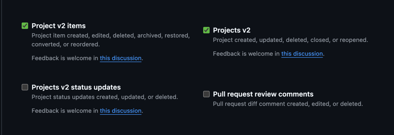

<head>
  <meta name="robots" content="index,follow" />
  <meta name="author" content="CSlant" />
  <meta name="generator" content="Docusaurus" />
  <meta name="theme-color" content="#2e8555" />
  
  <link rel="canonical" href="https://docs.cslant.com/github-project-php/getting-started/configuration" />
  
  <meta property="og:title" content="Configuration GitHub Project PHP" />
  <meta property="og:description" content="All configuration for GitHub Project PHP to get started with it. Create interactions, set up the environment, and get the package ready for use." />
  <meta property="og:type" content="article" />
  <meta property="og:url" content="https://docs.cslant.com/github-project-php/getting-started/configuration" />
  <meta property="og:site_name" content="GitHub Project PHP Documentation" />
  <meta property="og:locale" content="en_US" />
  
  <meta name="twitter:card" content="summary_large_image" />
  <meta name="twitter:title" content="Configuration GitHub Project PHP" />
  <meta name="twitter:description" content="All configuration for GitHub Project PHP to get started with it. Create interactions, set up the environment, and get the package ready for use." />
  <meta name="twitter:creator" content="@cslantofficial" />
  <meta name="twitter:site" content="@cslantofficial" />
  
  <meta name="format-detection" content="telephone=no" />
  <meta name="mobile-web-app-capable" content="yes" />
  <meta name="apple-mobile-web-app-capable" content="yes" />
  <meta name="apple-mobile-web-app-status-bar-style" content="default" />
  
  <meta property="article:published_time" content="2025-07-21T00:00:00Z" />
  <meta property="article:modified_time" content="2025-07-21T00:00:00Z" />
  <meta property="article:author" content="CSlant" />
  <meta property="article:section" content="Documentation" />
  
</head>

# 🛠 Configuration

# Configuration

GitHub Project PHP is highly configurable. This page explains all the available configuration options and their purposes.

## Publishing the Configuration File

First, publish the configuration file if you haven't already:

```bash
php artisan vendor:publish --provider="CSlant\GitHubProject\GithubProjectServiceProvider" --tag="config"
```

This will create a `github-project.php` file in your `config` directory.

## Configuration Options

Here's the complete configuration file with detailed explanations for each option:

```php title="config/github-project.php"
<?php

// The route prefix for webhook endpoints
$routePrefix = env('GITHUB_PROJECT_ROUTE_PREFIX', 'github-project');

return [
    // The name of your application/project
        'name' => 'GitHubProject',

    // The route prefix for the package's webhook routes
    'route_prefix' => $routePrefix,

    // GitHub API configuration
    'github' => [
        // Your GitHub personal access token
        // Required scopes: repo, project, write:discussion
        'access_token' => env('GITHUB_ACCESS_TOKEN', ''),
        
        // GitHub GraphQL API URL (usually doesn't need to be changed)
        'graphql_url' => env('GITHUB_GRAPHQL_URL', 'https://api.github.com/graphql'),
    ],

    // Enable/disable status comments on field changes
    'enable_status_comment' => env('GITHUB_PROJECT_ENABLE_STATUS_COMMENT', false),

    // Enable/disable queue processing of webhook events
    'is_queue_enabled' => env('GITHUB_PROJECT_QUEUE_ENABLED', false),
    
    // Cache key for comment aggregation
    'comment_aggregation_cache_key' => env('GITHUB_PROJECT_COMMENT_AGGREGATION_CACHE_KEY', 'github-project-comment-aggregation'),
    
    // Time in seconds to wait before aggregating comments
    'comment_aggregation_time' => env('GITHUB_PROJECT_COMMENT_AGGREGATION_TIME', 20),
];
```

## Environment Variables

For security and flexibility, it's recommended to set these values in your `.env` file:

```env
# Required
GITHUB_ACCESS_TOKEN=your_github_access_token

# Optional - Route prefix (default: github-project)
GITHUB_PROJECT_ROUTE_PREFIX=github-project

# Optional - Enable/disable status comments (default: true)
GITHUB_PROJECT_ENABLE_STATUS_COMMENT=true

# Optional - Enable/disable queue processing (default: false)
GITHUB_PROJECT_QUEUE_ENABLED=false

# Optional - Cache key for comment aggregation
GITHUB_PROJECT_COMMENT_AGGREGATION_CACHE_KEY=github-project-comment-aggregation

# Optional - Time in seconds to wait before aggregating comments (default: 20)
GITHUB_PROJECT_COMMENT_AGGREGATION_TIME=20
```

## GitHub Access Token

To generate a GitHub access token:

1. Go to [GitHub Settings > Developer settings > Personal access tokens](https://github.com/settings/tokens)
2. Click "Generate new token"
3. Give it a descriptive name
4. Select these scopes:
   - `projects_v2` - For organization projects
   - `projects_v2_items` - For project items
   


5. Click "Generate token" and copy it to your `.env` file

## Webhook Secret

For added security, set a webhook secret in your `.env` file and use the same secret when setting up the webhook in GitHub.

## Queue Configuration

If you enable queue processing (`GITHUB_PROJECT_QUEUE_ENABLED=true`), make sure your queue worker is running:

```bash
php artisan queue:work
```

Or if you're using a queue driver like Redis or database, make sure it's properly configured in your `config/queue.php` file.

## Next Steps

- [Set up webhooks](./webhook-setup) to start receiving GitHub events
- [Customize the templates](../advanced/templates) to change how comments are formatted
- Check out the [examples](../examples) for common use cases

